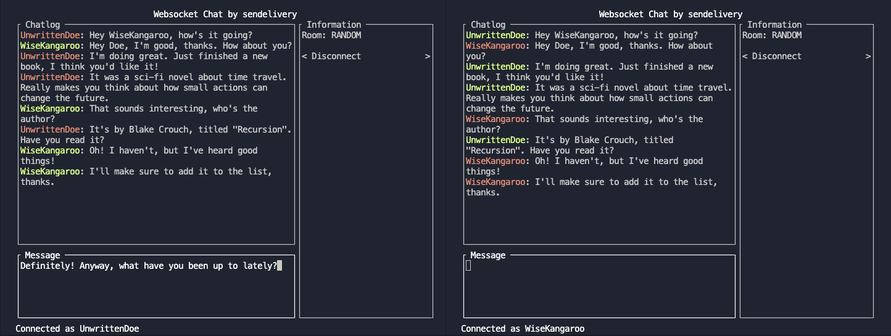

# websocket-chat

Chat with your friends (provided you're all using the same computer) using a slick console interface!



## Getting Started

### Requirements
- Python 3.12 or greater

### Installation
This project uses the venv module to manage virtual environments and pip for dependency management.

On Linux / MacOS:

```sh
python -m venv .venv
source .venv/bin/activate
pip install -r requirements.txt
```

Once all dependencies have been installed, you can start a local server or join a local server as a client.

### Start a local server

```sh
python -m server
```

### Join a local server

```sh
python -m client
```